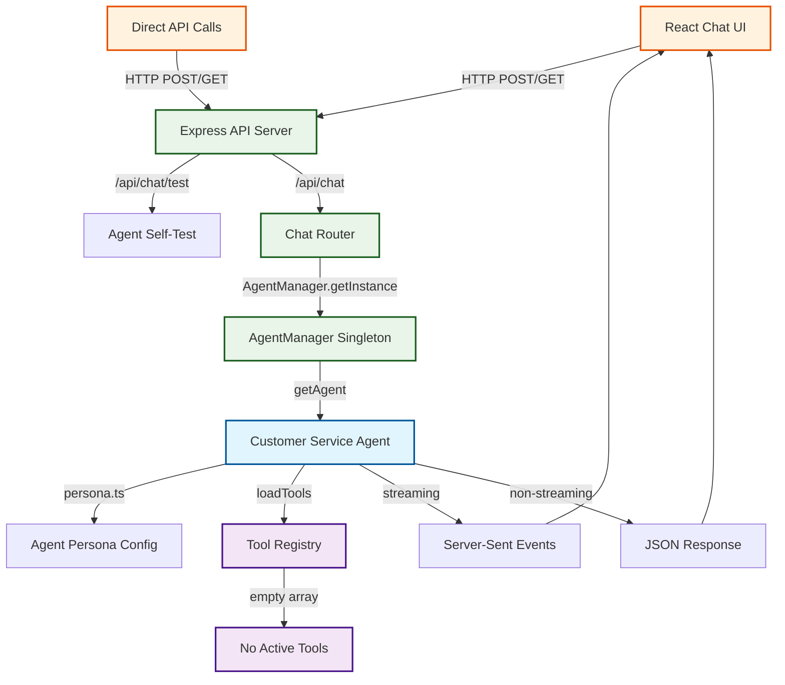
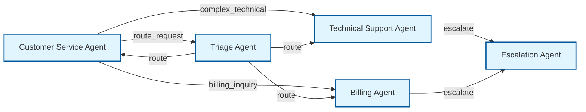
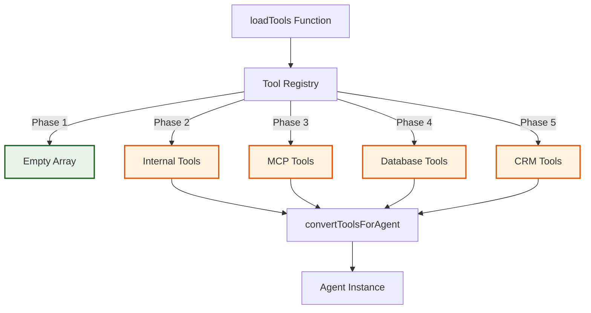

# Agent Architecture Reference

> **Living Document**: This file tracks the evolving agent architecture for the Waddle demo application. Update this document whenever agents, tools, or interaction flows are modified.

## Quick Reference

- **Current Agents**: 1 (Customer Service Agent)
- **Active Tools**: 0 (placeholder system ready)
- **Interaction Methods**: 2 (Streaming Chat, API Chat)
- **Last Updated**: 2025-06-29

## Agent Flow Overview



## Current Agent Inventory

### 1. Customer Service Agent
- **ID**: `waddle-customer-service-agent`
- **File**: `server/src/config/persona.ts`
- **Model**: `gpt-4o-mini` (configurable via `AGENT_MODEL`)
- **Purpose**: General customer service inquiries and support
- **Tools**: None (empty array from `loadTools()`)
- **Context**: None (static configuration)
- **Status**: ✅ Active

#### Configuration
```typescript
{
  name: 'waddle-customer-service-agent',
  model: getAgentModel(), // env: AGENT_MODEL || 'gpt-4o-mini'
  instructions: AGENT_PERSONA, // Static string
  tools: [], // Empty - ready for implementation
  context: undefined // No context injection
}
```

#### Capabilities
- [x] Customer service persona with professional tone
- [x] Streaming and non-streaming responses
- [x] Session management
- [x] Error recovery and retry logic
- [ ] Tool execution (infrastructure ready)
- [ ] Context-aware responses
- [ ] Agent handoffs

#### Interaction Methods
1. **Streaming Chat** (Primary)
   - **Endpoint**: `GET /api/chat?message=...&stream=true`
   - **Endpoint**: `POST /api/chat` with `{"stream": true}`
   - **Protocol**: Server-Sent Events (SSE)
   - **Events**: `connected`, `text_delta`, `tool_call`, `agent_updated`, `final_result`, `stream_complete`, `error`

2. **JSON API** (Secondary)
   - **Endpoint**: `POST /api/chat` with `{"stream": false}`
   - **Protocol**: Standard HTTP JSON
   - **Response**: Single JSON object with complete response

3. **Self-Test** (Diagnostics)
   - **Endpoint**: `GET /api/chat/test`
   - **Purpose**: Validate agent initialization and basic functionality
   - **Response**: Health status and basic agent response

## Planned Agent Expansion

### Future Agent Types
> Add new agents to this section as they are planned/implemented

| Agent Type | Purpose | Priority | Status | Tools Needed |
|------------|---------|----------|--------|--------------|
| Triage Agent | Route inquiries to specialized agents | High | 📋 Planned | Classification, Routing |
| Technical Support | Handle technical issues | Medium | 📋 Planned | System Check, Documentation |
| Billing Agent | Handle payment and billing | Medium | 📋 Planned | Payment Systems, CRM |
| Escalation Agent | Handle complex issues | Low | 📋 Planned | Case Management, Human Handoff |

### Agent Handoff Flow (Planned)


## Tool Integration Architecture

### Current Tool System
- **Registry**: `ToolRegistry` class in `server/src/lib/loadTools.ts`
- **Status**: Infrastructure complete, no tools loaded
- **Categories**: `database`, `crm`, `api`, `mcp`, `utility`

### Planned Tools
> Update this section as tools are implemented

| Tool Name | Category | Purpose | Agent(s) | Status |
|-----------|----------|---------|----------|--------|
| Knowledge Base Search | `database` | Search help articles | All | 📋 Planned |
| CRM Lookup | `crm` | Customer information | CSA, Billing | 📋 Planned |
| Ticket Creation | `api` | Create support tickets | All | 📋 Planned |
| System Status Check | `utility` | Check service health | Technical | 📋 Planned |

### Tool Loading Flow


## SDK Integration Status

### Implemented SDK Features ✅
- [x] Basic Agent creation with `new Agent()`
- [x] Agent configuration (name, model, instructions)
- [x] Streaming with `run(agent, message, {stream: true})`
- [x] Tool framework (empty but ready)
- [x] Error handling and lifecycle management

### Missing SDK Features 📋
- [ ] **Context Injection**: `context` parameter for dependency injection
- [ ] **Dynamic Instructions**: Function-based instructions instead of static strings
- [ ] **Structured Output**: `outputType` with Zod schemas
- [ ] **Model Settings**: `modelSettings.tool_choice` configuration
- [ ] **Guardrails**: Input/output validation and transformation
- [ ] **Agent Handoffs**: Delegating to specialized sub-agents

### SDK Documentation Links
- [Agent Concepts](https://openai.github.io/openai-agents-js/guides/agents/)
- [Tool Integration](https://openai.github.io/openai-agents-js/guides/tools/)
- [Agent Handoffs](https://openai.github.io/openai-agents-js/guides/handoffs/)
- [TypeDoc Reference](https://openai.github.io/openai-agents-js/reference/)

## File Structure Reference

### Agent Implementation Files
```
server/src/
├── config/
│   └── persona.ts              # Agent configurations and personas
├── lib/
│   ├── agent.ts               # AgentManager and agent lifecycle
│   └── loadTools.ts           # Tool discovery and loading
├── routes/
│   └── chat.ts                # API endpoints for agent interaction
└── types/
    └── agent.ts               # TypeScript definitions
```

### Key Functions
- `createAgent()`: Initialize agent instance
- `AgentManager.getInstance()`: Singleton pattern for agent management
- `loadTools()`: Tool discovery and registration
- `run(agent, message, options)`: Execute agent with message

## Development Guidelines

### Adding New Agents
1. **Create Persona**: Add configuration to `persona.ts`
2. **Update AgentManager**: Modify to handle multiple agent types
3. **Add Routing**: Update chat routes to route to appropriate agents
4. **Update This Document**: Add agent to inventory and flow diagrams

### Adding New Tools
1. **Implement Tool**: Add to appropriate category in `loadTools.ts`
2. **Register Tool**: Use `ToolRegistry.register()`
3. **Test Integration**: Ensure agent can discover and use tool
4. **Update This Document**: Add tool to planned tools table

### Updating Agent Flows
1. **Modify Mermaid Diagrams**: Update flow charts in this document
2. **Update Interaction Methods**: Document new endpoints or protocols
3. **Test End-to-End**: Ensure UI → API → Agent → Tool flow works
4. **Update Quick Reference**: Keep metadata current

## Instructions for Future AI Coding Agents

### Updating This Document
When modifying the agent architecture, **always update this document** by:

1. **Quick Reference Section**: Update counts and last modified date
2. **Agent Inventory**: 
   - Add new agents with complete metadata
   - Update status and capabilities
   - Modify configuration examples
3. **Mermaid Diagrams**: 
   - Update flow charts to reflect new agents/connections
   - Add new interaction paths
   - Keep styling consistent with existing classDef
4. **Tool Integration**: 
   - Move tools from "Planned" to implementation status
   - Add new tool categories as needed
   - Update tool loading phases

### Mermaid Diagram Standards
- **Agent nodes**: Use `classDef agent fill:#e1f5fe,stroke:#01579b,stroke-width:2px`
- **Tool nodes**: Use `classDef tool fill:#f3e5f5,stroke:#4a148c,stroke-width:2px` 
- **API nodes**: Use `classDef api fill:#e8f5e8,stroke:#1b5e20,stroke-width:2px`
- **UI nodes**: Use `classDef ui fill:#fff3e0,stroke:#e65100,stroke-width:2px`
- **Flow direction**: Use `TB` (top-bottom) for architecture, `LR` (left-right) for handoffs

### Critical Maintenance Rules
1. **Never remove agents** without archiving their configuration
2. **Always test changes** end-to-end before updating this document
3. **Keep SDK feature status current** as new features are implemented
4. **Maintain backward compatibility** in agent APIs when possible
5. **Update interaction methods** whenever endpoints change

### Code References
When documenting changes, include:
- **File paths**: Exact locations of modified files
- **Function names**: Key functions that were added/modified  
- **Configuration examples**: Working code snippets
- **Testing commands**: How to verify the changes work

---

**Maintenance Schedule**: Update this document with every agent/tool modification  
**Review Cycle**: Monthly architecture review for optimization opportunities  
**Version Control**: Track major architecture changes in git commit messages