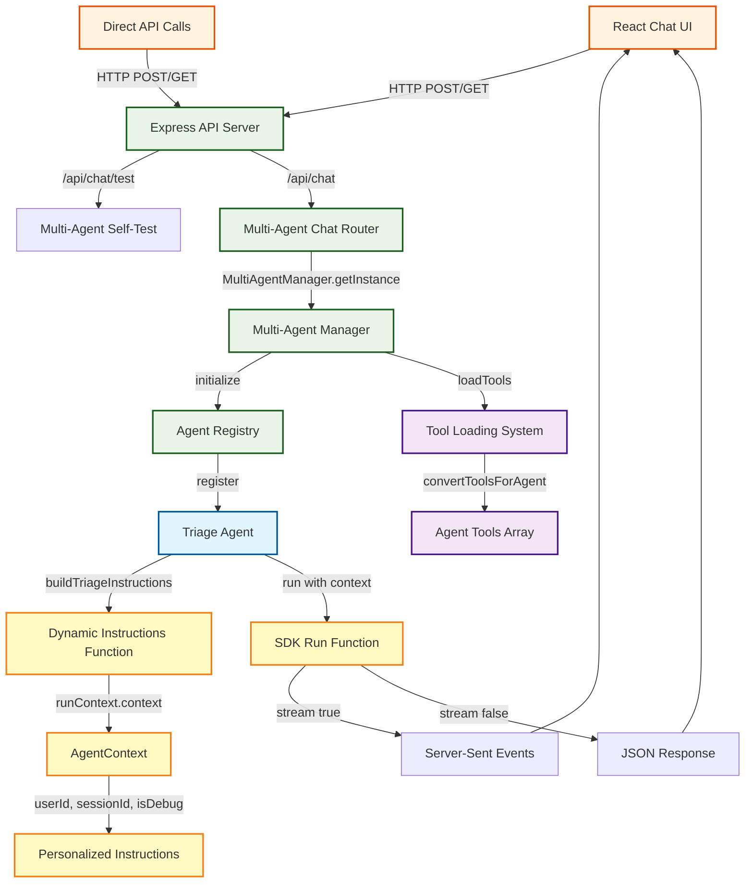
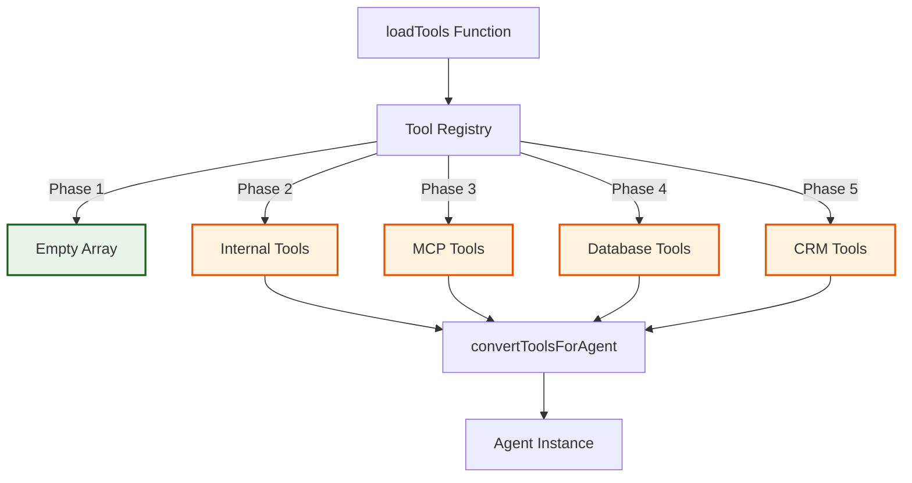

# Agent Architecture Reference

> **Living Document**: This file tracks the evolving agent architecture for the Waddle demo application. Update this document whenever agents, tools, or interaction flows are modified.

## Quick Reference

- **Current Agents**: 1 (Triage Agent)
- **Active Tools**: 0 (tool loading system ready)
- **Interaction Methods**: 1 (Multi-Agent System with Streaming Support)
- **Architecture Pattern**: Multi-Agent Registry with Dynamic Instructions
- **Last Updated**: 2025-06-29 (Legacy system removed)

## Runtime Agent Flow (Current State)



### Chart Accuracy Maintenance (Critical Process)

**⚠️ REQUIRED BEFORE ANY CHART UPDATES**: All future coding agents must follow this process to ensure Mermaid charts remain accurate and synchronized with the actual codebase.

#### Chart Verification Checklist
Before updating any Mermaid diagram, complete these verification steps:

1. **Agent Name Verification**:
   - Check `server/src/agents/` directory for actual agent file names
   - Verify agent names in chart match the `name` property in agent creation functions
   - Cross-reference with "Current Agent Inventory" section below
   - Ensure Registry IDs match the `type` values in agent registration

2. **Implementation Cross-Reference**:
   - Check `server/src/lib/multi-agent-manager.ts` for registered agent types
   - Verify chart shows only agents that are actually registered
   - Confirm agent descriptions match registry descriptions
   - Validate tool counts and capabilities match reality

3. **Chart Element Validation**:
   - Ensure all agent nodes in chart exist in codebase
   - Verify flow connections match actual code execution paths
   - Check that styling classes are applied to correct node types
   - Confirm endpoint paths match actual route definitions

4. **Consistency Check**:
   - Agent display names in chart must match inventory section headers
   - Registry IDs must be consistent between chart and documentation
   - Model configurations should reflect actual environment variables
   - Tool arrays should match what's actually loaded

#### Process for Chart Updates
1. **Before Changes**: Run the verification checklist above
2. **Identify Issues**: Document any inconsistencies found
3. **Source of Truth**: Use actual source code as the authoritative reference
4. **Update Order**: Fix chart first, then update inventory section to match
5. **Final Verification**: Re-run checklist to ensure all elements are synchronized

#### Enforcement
- **Any chart update without following this process will be rejected**
- **Charts that fail verification must be corrected before proceeding**
- **When in doubt, check the source code, not existing documentation**

## Current Agent Inventory (Runtime State)

### 1. Triage Agent
- **Registry ID**: `triage`
- **Agent Name**: `triage-agent`
- **File**: `server/src/agents/triage-agent.ts`
- **Model**: `gpt-4o-mini` (configurable via `TRIAGE_AGENT_MODEL` or `AGENT_MODEL`)
- **Purpose**: Customer service inquiries and support with context-aware responses
- **Tools**: Dynamically loaded from tool system (currently empty array)
- **Context**: Full AgentContext injection with user/session data
- **Instructions**: Dynamic function `buildTriageInstructions(runContext, agent)`
- **Status**: ✅ Active (Refactored to SDK patterns)

#### Runtime Configuration
```typescript
// Created by: createTriageAgent(tools)
{
  name: 'triage-agent',
  model: process.env.TRIAGE_AGENT_MODEL || process.env.AGENT_MODEL || 'gpt-4o-mini',
  instructions: buildTriageInstructions, // Dynamic function
  tools: tools, // Loaded from tool system
}

// Registered in AgentRegistry as:
{
  type: 'triage',
  agent: triageAgent,
  description: 'Analyzes customer inquiries and provides support (converted from customer service agent)',
  canReceiveHandoffs: false,
  metadata: {
    model: string,
    toolCount: number,
    hasStructuredOutput: true,
    supportedCapabilities: ['customer_service', 'inquiry_analysis', 'support']
  }
}
```

#### Runtime Capabilities
- [x] **Dynamic instructions** based on user context (userId, sessionId, debug mode)
- [x] **Context injection** via AgentContext interface
- [x] **Streaming and non-streaming** responses via SDK run() function
- [x] **Session management** with context persistence
- [x] **Multi-agent infrastructure** ready for scaling
- [x] **Tool integration** framework (empty but functional)
- [x] **Error recovery** and retry logic
- [x] **Environment-aware** model selection

#### Interaction Methods
1. **Streaming Chat** (Primary)
   - **Endpoint**: `GET /api/chat?message=...&stream=true`
   - **Endpoint**: `POST /api/chat` with `{"stream": true}`
   - **Protocol**: Server-Sent Events (SSE)
   - **Events**: `connected`, `text_delta`, `tool_call`, `agent_updated`, `final_result`, `stream_complete`, `error`

2. **JSON API** (Secondary)
   - **Endpoint**: `POST /api/chat` with `{"stream": false}`
   - **Protocol**: Standard HTTP JSON
   - **Response**: Single JSON object with complete response

3. **Self-Test** (Diagnostics)
   - **Endpoint**: `GET /api/chat/test`
   - **Purpose**: Validate agent initialization and basic functionality
   - **Response**: Health status and basic agent response

## Dynamic Instructions Architecture

### buildTriageInstructions Function

The `buildTriageInstructions` function represents a key SDK pattern that replaces static instruction strings with dynamic, context-aware instruction generation.

#### Function Signature
```typescript
function buildTriageInstructions(runContext: RunContext<AgentContext>, _agent: any): string
```

#### How It Works
1. **Runtime Execution**: Called each time the agent runs, not at agent creation
2. **Context Access**: Receives `runContext.context` containing session and user data
3. **Dynamic Content**: Generates personalized instructions based on:
   - `context.userId` - Whether user is authenticated
   - `context.sessionId` - Current session identifier  
   - `context.isDebug` - Debug mode status
   - `context.source` - Request source (ui/api/test)

#### Example Dynamic Content
```typescript
const userContext = context.userId 
  ? `Customer ID: ${context.userId}\nAuthenticated user`
  : 'Unauthenticated user';

const debugMode = context.isDebug 
  ? '\n\nDEBUG MODE: Provide detailed explanations' 
  : '';

return `You are a customer service agent for Waddle.
${userContext}
Session: ${context.sessionId}
${debugMode}`;
```

#### Tradeoffs vs Static Instructions

**✅ Advantages of Dynamic Instructions:**
- **Personalization**: Instructions adapt to user authentication status
- **Session Awareness**: Can reference specific session IDs for logging
- **Debug Support**: Different behavior in development vs production
- **Context Sensitivity**: Can adjust tone/approach based on request source
- **Future Extensibility**: Easy to add new contextual data

**❌ Disadvantages of Dynamic Instructions:**
- **Runtime Overhead**: Function called on every agent run
- **Debugging Complexity**: Instructions vary by context, harder to debug
- **Potential Inconsistency**: Same agent may behave differently across contexts
- **Memory Usage**: Context objects created for each run
- **Testing Complexity**: Must test various context combinations

**🔄 When to Use Each:**
- **Static**: Stable agent personalities, consistent behavior requirements
- **Dynamic**: User-aware agents, multi-tenant systems, debug modes

## Creating New Agents

### Step-by-Step Guide

#### 1. Create Agent Definition File
**File**: `server/src/agents/{agent-name}-agent.ts`

```typescript
import { Agent } from '@openai/agents';
import type { AgentContext, RunContext } from './types.js';

/**
 * Dynamic instructions function for {Agent Name}
 * Example: For a billing agent, this would be buildBillingInstructions
 */
function build{AgentName}Instructions(runContext: RunContext<AgentContext>, _agent: any): string {
  const { context } = runContext;
  // Add context-aware instruction logic here
  return `You are a {agent purpose} for Waddle...`;
}

/**
 * Create the {agent name} agent
 * Example: For a billing agent, this would be createBillingAgent
 */
export function create{AgentName}Agent(tools: any[] = []) {
  return new Agent<AgentContext>({
    name: '{agent-name}-agent',  // Example: 'billing-agent'
    model: process.env.{AGENT_NAME}_AGENT_MODEL || process.env.AGENT_MODEL || 'gpt-4o-mini',
    instructions: build{AgentName}Instructions,
    tools: tools,
  });
}
```

#### 2. Update Agent Types
**File**: `server/src/agents/types.ts`

```typescript
// Add new agent type to the union
export type AgentType = 'triage' | 'billing' | 'technical' | 'your-new-agent';
```

#### 3. Register Agent in Multi-Agent Manager
**File**: `server/src/lib/multi-agent-manager.ts`

```typescript
// In loadAgents() method:
const { create{AgentName}Agent } = await import('../agents/{agent-name}-agent.js');
const yourNewAgent = create{AgentName}Agent(tools);

registry.register({
  type: 'your-new-agent',
  agent: yourNewAgent,
  description: 'Agent description for registry',
  canReceiveHandoffs: true, // or false for entry points
  metadata: {
    model: process.env.{AGENT_NAME}_AGENT_MODEL || process.env.AGENT_MODEL || 'gpt-4o-mini',
    toolCount: tools.length,
    hasStructuredOutput: false, // or true if using Zod
    supportedCapabilities: ['capability1', 'capability2'],
  },
});
```

#### 4. Update Multi-Agent Routes (Usually Not Needed)
**File**: `server/src/routes/multi-agent-chat.ts`

The routes already support dynamic agent selection via the `agentType` parameter:
- GET: `/api/chat?agentType=your-new-agent&message=...`
- POST: `/api/chat` with body `{"agentType": "your-new-agent", "message": "..."}`

No changes needed unless you want to:
- Change the default agent (currently 'triage')
- Add agent-specific validation or preprocessing
- Create dedicated endpoints for specific agents

#### 5. Test Integration
- **Unit Test**: Create agent with `create{AgentName}Agent([])`
- **Registry Test**: Verify agent appears in `AgentRegistry.getAll()`
- **Runtime Test**: Call `MultiAgentManager.runAgent('your-new-agent', 'test message', context)`
- **API Test**: 
  ```bash
  # Test via GET
  curl "http://localhost:3001/api/chat?agentType=your-new-agent&message=Hello&stream=false"
  
  # Test via POST
  curl -X POST http://localhost:3001/api/chat \
    -H "Content-Type: application/json" \
    -d '{"agentType": "your-new-agent", "message": "Hello", "stream": false}'
  ```

#### 6. Update This Documentation (REQUIRED)
**CRITICAL**: You MUST update AGENT_ARCHITECTURE.md after creating a new agent.

Add the new agent to the "Current Agent Inventory" section above with:
- Registry ID, Agent Name, File location
- Model configuration and environment variables  
- Purpose and capabilities
- Runtime configuration example
- Update the Quick Reference section agent count
- Update the Last Updated date

**Example addition to Current Agent Inventory:**
```markdown
### 2. Billing Agent
- **Registry ID**: `billing`
- **Agent Name**: `billing-agent`
- **File**: `server/src/agents/billing-agent.ts`
- **Model**: `gpt-4o-mini` (configurable via `BILLING_AGENT_MODEL` or `AGENT_MODEL`)
- **Purpose**: Handle billing inquiries, payment processing, and subscription management
- **Tools**: Payment API, Subscription Manager, Invoice Generator
- **Context**: Full AgentContext injection with user/session data
- **Instructions**: Dynamic function `buildBillingInstructions(runContext, agent)`
- **Status**: ✅ Active
```

### Required File Changes Summary
1. **Create**: `server/src/agents/{agent-name}-agent.ts`
2. **Modify**: `server/src/agents/types.ts` (add AgentType)
3. **Modify**: `server/src/lib/multi-agent-manager.ts` (register agent)
4. **REQUIRED**: `AGENT_ARCHITECTURE.md` (update agent inventory, counts, and date)
5. **Optional**: Update route handlers if direct access needed
6. **Optional**: Update `getDefaultAgent()` if changing default agent

### Changing the Default Agent
If you want your new agent to be the default (instead of 'triage'):

**File**: `server/src/lib/multi-agent-manager.ts`
```typescript
getDefaultAgent(): AgentType {
  return 'your-new-agent'; // Changed from 'triage'
}
```

Note: The default agent is used when no `agentType` is specified in API requests.

## Creating New Tools

### Tool System Overview

The application uses a custom tool system that integrates with the OpenAI Agents SDK:
- **Tool Definition**: Custom `ToolDefinition` interface in `server/src/lib/loadTools.ts`
- **Tool Registry**: Singleton registry for managing available tools
- **SDK Integration**: `convertToolsForAgent()` function converts to [SDK tool format](https://openai.github.io/openai-agents-js/guides/tools/)
- **Tool Categories**: `database`, `crm`, `api`, `mcp`, `utility`
- **Shared Tools**: All agents share the same tool set loaded at startup

### Step-by-Step Guide

#### 1. Create Tool Definition File
**Location**: `server/src/tools/{tool-name}.ts` (create `tools` directory if needed)

```typescript
import type { ToolDefinition } from '../lib/loadTools.js';

/**
 * Example: Weather lookup tool
 * Replace with your actual tool implementation
 */
export const weatherLookupTool: ToolDefinition = {
  name: 'weather_lookup',  // Must be unique, use snake_case
  description: 'Get current weather information for a specified city',
  category: 'api',  // Choose: database, crm, api, mcp, utility
  parameters: {
    type: 'object',
    properties: {
      city: {
        type: 'string',
        description: 'The city to get weather for'
      },
      units: {
        type: 'string',
        enum: ['celsius', 'fahrenheit'],
        description: 'Temperature units',
        default: 'celsius'
      }
    },
    required: ['city']
  },
  implementation: async (args: Record<string, any>) => {
    const { city, units = 'celsius' } = args;
    
    // Your tool implementation here
    // This example returns mock data
    return {
      city,
      temperature: units === 'celsius' ? 22 : 72,
      conditions: 'Partly cloudy',
      humidity: 65
    };
  },
  requiresApproval: false  // Set to true for sensitive operations
};
```

#### 2. Register Tool in loadTools()
**File**: `server/src/lib/loadTools.ts`

Add your tool import and registration around line 150 in the `loadTools()` function:

```typescript
export async function loadTools(): Promise<ToolDefinition[]> {
  if (toolRegistry.isInitialized()) {
    return toolRegistry.getAll();
  }

  try {
    // Import your tool
    const { weatherLookupTool } = await import('../tools/weather-lookup.js');
    
    // Add to tools array
    const tools: ToolDefinition[] = [
      weatherLookupTool,
      // Add more tools here
    ];

    // Register tools (existing code)
    tools.forEach(tool => toolRegistry.register(tool));
    
    // ... rest of existing code
  }
}
```

#### 3. Tool Implementation Best Practices
Based on [SDK Function Tools guidance](https://openai.github.io/openai-agents-js/guides/tools/#function-tools):

- **Clear Descriptions**: Write explicit, detailed descriptions for tools and parameters
- **Error Handling**: Always handle errors gracefully in your implementation
- **Validation**: Validate inputs even though parameters schema provides basic validation
- **Async Operations**: All tool implementations should return a Promise
- **Return Types**: Return structured data that agents can easily interpret

#### 4. Test Your Tool

**Unit Test** (create `server/src/tools/__tests__/{tool-name}.test.ts`):
```typescript
import { weatherLookupTool } from '../weather-lookup.js';

describe('Weather Lookup Tool', () => {
  it('should return weather data for a city', async () => {
    const result = await weatherLookupTool.implementation({
      city: 'London',
      units: 'celsius'
    });
    
    expect(result).toHaveProperty('city', 'London');
    expect(result).toHaveProperty('temperature');
    expect(result).toHaveProperty('conditions');
  });
});
```

**Manual Test via executeTool**:
```typescript
// In a test file or REPL
import { executeTool, loadTools } from '../lib/loadTools.js';

await loadTools();
const result = await executeTool('weather_lookup', { city: 'Paris' });
console.log(result);
```

**Integration Test with Agent**:
```bash
# Test the tool through an agent
curl -X POST http://localhost:3001/api/chat \
  -H "Content-Type: application/json" \
  -d '{
    "message": "What is the weather in Tokyo?",
    "stream": false
  }'
```

#### 5. Update This Documentation (REQUIRED)
**CRITICAL**: You MUST update AGENT_ARCHITECTURE.md after creating a new tool.

1. **Update Tool Count** in Quick Reference section (line ~8)
2. **Update Last Updated** date
3. **Move Tool from Planned to Implemented** in the Tool Integration Architecture section (line ~602)

**Example update to Planned Tools table:**
```markdown
| Tool Name | Category | Purpose | Agent(s) | Status |
|-----------|----------|---------|----------|--------|
| Weather Lookup | `api` | Get weather information | All | ✅ Implemented |
```

### Tool Categories Explained

Reference: `server/src/lib/loadTools.ts` line 33

- **`database`**: Tools that query or modify database records
- **`crm`**: Customer relationship management integrations
- **`api`**: External API calls and web services
- **`mcp`**: Model Context Protocol server integrations
- **`utility`**: Helper functions and internal utilities

Use `getToolRegistry().getByCategory('api')` to retrieve tools by category.

### SDK Integration Notes

Our tool system differs from the [SDK's tool() helper](https://openai.github.io/openai-agents-js/guides/tools/#function-tools):

| Feature | Our System | SDK Native |
|---------|------------|------------|
| Definition | `ToolDefinition` interface | `tool()` helper function |
| Parameters | JSON Schema | Zod schemas |
| Execution | `executeTool()` function | Direct function call |
| Registration | `ToolRegistry` class | Inline with agent |

The `convertToolsForAgent()` function (line 189 in `loadTools.ts`) handles the conversion from our format to the SDK's expected format.

### Advanced Tool Features

#### Tool Approval
Set `requiresApproval: true` for sensitive operations:
```typescript
requiresApproval: true  // Agent will seek user approval before execution
```
Use `getApprovalRequiredTools()` to list all tools requiring approval.

#### Dynamic Tool Loading
For development, use `reloadTools()` to refresh tools without restarting:
```typescript
import { reloadTools } from './lib/loadTools.js';
await reloadTools();
```

### Required File Changes Summary
1. **Create**: `server/src/tools/{tool-name}.ts`
2. **Modify**: `server/src/lib/loadTools.ts` (import and add to tools array)
3. **REQUIRED**: `AGENT_ARCHITECTURE.md` (update tool inventory and counts)
4. **Optional**: Create unit tests in `server/src/tools/__tests__/`

### Common Issues and Solutions

1. **Tool Not Available to Agent**
   - Verify tool is imported in `loadTools()`
   - Check that `toolRegistry.register()` is called
   - Restart the server after adding tools

2. **Parameter Validation Errors**
   - Ensure parameters follow JSON Schema format
   - Test parameter schema with a JSON Schema validator
   - Check required fields are properly defined

3. **Tool Execution Fails**
   - Check implementation returns a Promise
   - Verify error handling in implementation
   - Review logs with `NODE_ENV=development`

### Testing Commands Reference
```bash
# Start server with debug logging
NODE_ENV=development npm start

# Test tool listing
curl http://localhost:3001/api/chat/test

# Test tool execution through agent
curl -X POST http://localhost:3001/api/chat \
  -H "Content-Type: application/json" \
  -d '{"message": "Use the weather_lookup tool for London", "stream": false}'
```

For more information on tool types and patterns, see the [OpenAI Agents SDK Tools Guide](https://openai.github.io/openai-agents-js/guides/tools/).

## Future Agent Expansion

### Planned Agent Types
> This section should be updated when new agents are approved for development

| Agent Type | Purpose | Priority | Status | Implementation Notes |
|------------|---------|----------|--------|---------------------|
| *No agents planned* | *Request approval before adding* | - | - | Follow agent creation guide above |

## Tool Integration Architecture

### Current Tool System
- **Registry**: `ToolRegistry` class in `server/src/lib/loadTools.ts`
- **Status**: Infrastructure complete, no tools loaded
- **Categories**: `database`, `crm`, `api`, `mcp`, `utility`

### Planned Tools
> Update this section as tools are implemented

| Tool Name | Category | Purpose | Agent(s) | Status |
|-----------|----------|---------|----------|--------|
| Knowledge Base Search | `database` | Search help articles | All | 📋 Planned |
| CRM Lookup | `crm` | Customer information | CSA, Billing | 📋 Planned |
| Ticket Creation | `api` | Create support tickets | All | 📋 Planned |
| System Status Check | `utility` | Check service health | Technical | 📋 Planned |

### Tool Loading Flow


## SDK Integration Status (Post-Refactor)

### Implemented SDK Features ✅
- [x] **Agent Creation**: `new Agent<AgentContext>()` with proper typing
- [x] **Dynamic Instructions**: Function-based instructions with context access
- [x] **Context Injection**: Full `AgentContext` injection via `run()` function
- [x] **Streaming**: Both `{stream: true}` and `{stream: false}` support
- [x] **Tool Framework**: `tools` array integration (currently empty but functional)
- [x] **Error Handling**: Comprehensive error handling and lifecycle management
- [x] **Agent Registry**: Multi-agent discovery and management system
- [x] **Environment Configuration**: Model selection via environment variables

### Partially Implemented SDK Features 🔄
- [⚠️] **Structured Output**: Zod schemas defined but commented out (SDK type issues)
- [⚠️] **Agent Handoffs**: Infrastructure ready but no handoff targets implemented

### Not Yet Implemented SDK Features 📋
- [ ] **Model Settings**: `modelSettings.tool_choice` configuration
- [ ] **Guardrails**: Input/output validation and transformation
- [ ] **Advanced Tool Features**: Tool approval workflows, tool categories

### Implementation Notes
- **Context Injection**: Fully implemented with `AgentContext` interface
- **Dynamic Instructions**: Production-ready with `buildTriageInstructions` pattern
- **Structured Output**: Ready to enable when SDK types are stable

### SDK Documentation Links
- [Agent Concepts](https://openai.github.io/openai-agents-js/guides/agents/)
- [Tool Integration](https://openai.github.io/openai-agents-js/guides/tools/)
- [Agent Handoffs](https://openai.github.io/openai-agents-js/guides/handoffs/)
- [TypeDoc Reference](https://openai.github.io/openai-agents-js/reference/)

## File Structure Reference (Current)

### Multi-Agent System Files
```
server/src/
├── agents/
│   ├── index.ts                # AgentRegistry and agent discovery
│   ├── types.ts                # AgentContext, AgentType, interfaces
│   └── triage-agent.ts         # Triage Agent implementation
├── lib/
│   ├── multi-agent-manager.ts  # Multi-agent lifecycle management
│   └── loadTools.ts            # Tool discovery and loading
├── routes/
│   └── multi-agent-chat.ts     # Multi-agent API endpoints
└── types/
    └── agent.ts                # Core type definitions
```

### Key Runtime Functions
- `MultiAgentManager.getInstance()`: Multi-agent system management
- `AgentRegistry.register()`: Agent registration and discovery
- `createTriageAgent(tools)`: Create triage agent with tools
- `buildTriageInstructions(runContext, agent)`: Dynamic instruction generation
- `run(agent, message, {context, stream})`: Execute agent with context injection

## Development Guidelines (Updated)

### Adding New Agents (Revised Process)
**⚠️ Important**: Follow the step-by-step guide in "Creating New Agents" section above

### Adding New Tools
1. **Implement Tool**: Add to appropriate category in `loadTools.ts`
2. **Register Tool**: Use `ToolRegistry.register()`
3. **Test Integration**: Ensure agents can discover and use tool
4. **Update This Document**: Add tool to planned tools table

### Updating Agent Architecture
1. **Follow SDK Patterns**: Use dynamic instructions and context injection
2. **Test Backward Compatibility**: Ensure legacy wrapper still works
3. **Update Documentation**: Modify this file with new agent details
4. **Update Mermaid Diagrams**: Reflect new runtime flows

## Instructions for Future AI Coding Agents

### Updating This Document
When modifying the agent architecture, **always update this document** by:

1. **Quick Reference Section**: Update counts and last modified date
2. **Agent Inventory**: 
   - Add new agents with complete metadata
   - Update status and capabilities
   - Modify configuration examples
3. **Mermaid Diagrams**: 
   - Update flow charts to reflect new agents/connections
   - Add new interaction paths
   - Keep styling consistent with existing classDef
4. **Tool Integration**: 
   - Move tools from "Planned" to implementation status
   - Add new tool categories as needed
   - Update tool loading phases

### Mermaid Diagram Standards

#### Visual Styling
- **Agent nodes**: Use `classDef agent fill:#e1f5fe,stroke:#01579b,stroke-width:2px`
- **Tool nodes**: Use `classDef tool fill:#f3e5f5,stroke:#4a148c,stroke-width:2px` 
- **API nodes**: Use `classDef api fill:#e8f5e8,stroke:#1b5e20,stroke-width:2px`
- **UI nodes**: Use `classDef ui fill:#fff3e0,stroke:#e65100,stroke-width:2px`
- **Runtime nodes**: Use `classDef runtime fill:#fff9c4,stroke:#f57f17,stroke-width:2px`
- **Flow direction**: Use `TB` (top-bottom) for architecture, `LR` (left-right) for handoffs

#### Accuracy Requirements (MANDATORY)
- **Before any diagram edit**: Complete the Chart Verification Checklist above
- **Agent node names**: Must match exactly with `name` property in agent creation functions
- **Registry references**: Must use actual `type` values from agent registration
- **Flow connections**: Must reflect actual code execution paths in source files
- **Endpoint labels**: Must match actual route definitions in `server/src/routes/`
- **Tool references**: Must match what's actually loaded by `loadTools()` function

#### Verification Sources
- **Agent names**: Check `server/src/agents/[agent-name]-agent.ts` files
- **Registry data**: Check `server/src/lib/multi-agent-manager.ts` registration calls  
- **Route paths**: Check `server/src/routes/` directory for actual endpoint definitions
- **Tool loading**: Check `server/src/lib/loadTools.ts` for current tool implementations

#### Update Process
1. **Pre-update**: Run Chart Verification Checklist
2. **Edit diagrams**: Make changes based on source code verification
3. **Post-update**: Re-run checklist to ensure accuracy
4. **Documentation**: Update inventory sections to match corrected charts

### Critical Maintenance Rules
1. **NEVER add, remove, or change functionality without explicit permission**
2. **Only auto-accept changes that do not affect functionality**
3. **Request approval before implementing any new agents or features**
4. **Always test changes** end-to-end before updating this document
5. **Keep SDK feature status current** as new features are implemented
6. **Maintain backward compatibility** in agent APIs when possible
7. **Update interaction methods** whenever endpoints change

### Functional Change Guidelines
- **Refactoring**: Changing implementation without changing behavior (✅ Auto-accept)
- **New Agents**: Adding new agent types (❌ Requires explicit approval)
- **New Tools**: Adding new tool integrations (❌ Requires explicit approval)
- **API Changes**: Modifying endpoints or contracts (❌ Requires explicit approval)
- **Configuration**: Environment variables or model settings (⚠️ Request approval)

### Code References
When documenting changes, include:
- **File paths**: Exact locations of modified files
- **Function names**: Key functions that were added/modified  
- **Configuration examples**: Working code snippets
- **Testing commands**: How to verify the changes work
- **Approval Status**: Whether change was pre-approved or requires approval

### Runtime vs Compile-Time Focus
This document focuses on **runtime behavior** and **operational state**:
- How agents are instantiated and configured at runtime
- Context injection and dynamic instruction generation  
- Agent registry contents and discovery mechanisms
- Request flow through the multi-agent system
- Tool loading and integration patterns

---

**Maintenance Schedule**: Update this document with every agent/tool modification  
**Review Cycle**: Monthly architecture review for optimization opportunities  
**Version Control**: Track major architecture changes in git commit messages  
**Permission Policy**: No functional changes without explicit user approval